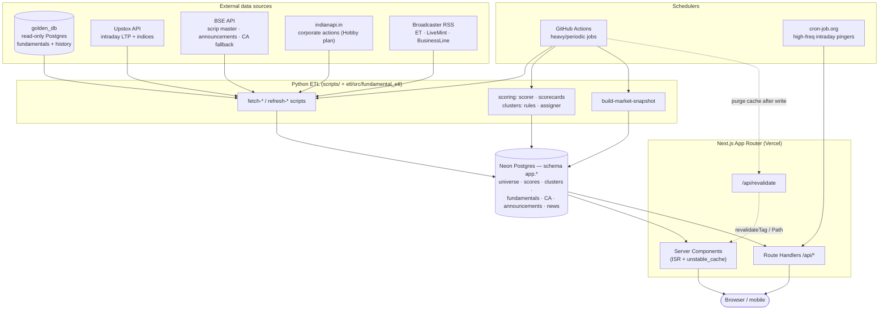
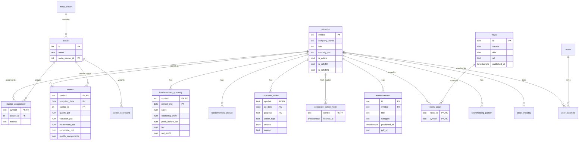
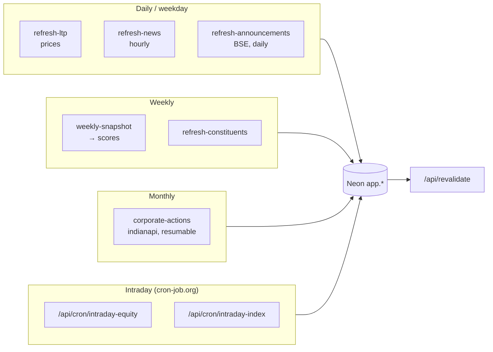
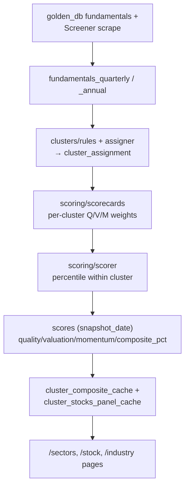
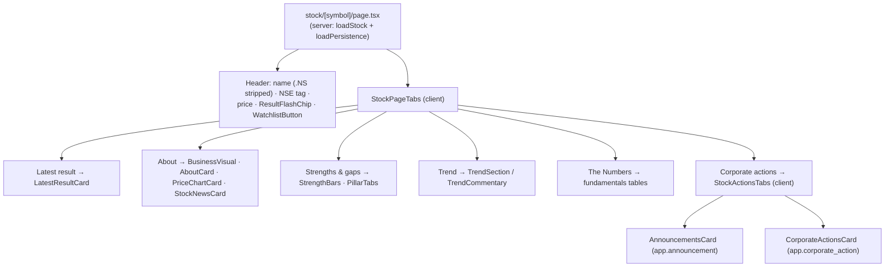
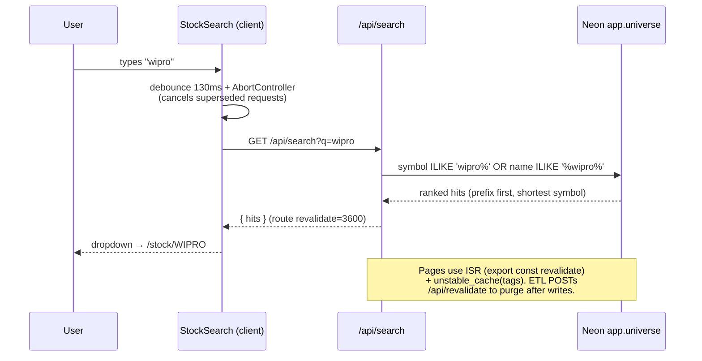
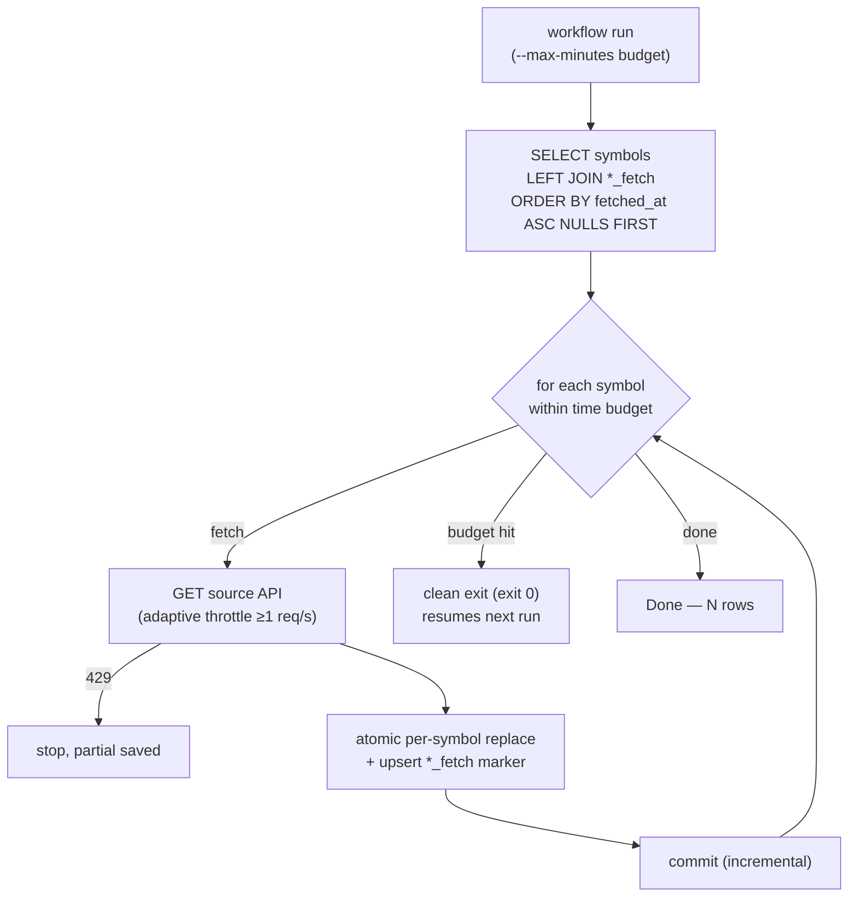

# EquityRoots — Low-Level Design

Insight-first NSE stock-scoring & narrative web app. Next.js (App Router) on
Vercel + Postgres on Neon, fed by scheduled Python ETL that reads a read-only
`golden_db` and several free/cheap external APIs.

All diagrams are [Mermaid](https://mermaid.live) — they render on GitHub, VS
Code, and most Markdown tools.

---

## 1. System architecture & data flow



---

## 2. Database ERD (core `app.*` tables)



---

## 3. Scheduled jobs (ETL cadence)

| Workflow | Cron (UTC) | IST | Script → table |
|---|---|---|---|
| `refresh-ltp` | `0 13 * * 1-5` | 18:30 wkdays | `refresh-ltp.py` → prices on `universe`/snapshot |
| `weekly-snapshot` | `0 13 * * 6` | Sat 18:30 | scoring pipeline → `scores` (append-only snapshot) |
| `refresh-news` | `0 2-17 * * *` | hourly 07:30–22:30 | `fetch-news.py` → `news`, `news_stock` |
| `refresh-announcements` | `0 22 * * *` | daily 03:30 | `fetch-announcements.py` → `announcement` |
| `refresh-corporate-actions` | `30 4 1 * *` | monthly 10:00 | `fetch-corporate-actions-iapi.py` → `corporate_action` |
| `refresh-constituents` | `0 4 * * 0` | Sun 09:30 | `fetch-index-constituents.py` → `index_constituent` |
| `freshness-check` | `30 */12 * * *` | every 12h | `check-freshness.py` (monitoring) |
| intraday pingers | cron-job.org (1–5 min) | market hours | `/api/cron/intraday-equity` · `/api/cron/intraday-index` |



---

## 4. Scoring pipeline (weekly snapshot)



> Scoring is **peer-relative**: each stock is percentiled within its cluster
> (46 industry peer groups), not the whole market. `scores` is append-only per
> `snapshot_date` so history is auditable.

---

## 5. Stock page component tree



---

## 6. Search + caching/request lifecycle



**Cache layers**
- **ISR page cache** — `export const revalidate`: stock page 6h, `/news` 5min, `/api/search` 1h.
- **`unstable_cache(tags)`** — tagged data (`sectors`, `panel-cache`, `market`, `snapshot`); busted via `revalidateTag`.
- **`/api/revalidate`** — bearer-token (`REVALIDATE_TOKEN`) or admin; accepts `{tags, paths}` for on-demand purges after ETL writes.

---

## 7. Resumable sweep (corporate actions & announcements)

Non-trivial because the full ~2,160-symbol sweeps are slow (API rate limits /
latency) and would otherwise restart at "A" every run and never finish.



> The `*_fetch` marker tables (`corporate_action_fetch`) record *attempt* time
> per symbol independent of whether rows resulted, so least-recently-fetched
> ordering advances past empty-history stocks and re-runs always make progress.

---

## Tech stack summary

| Layer | Tech |
|---|---|
| Frontend | Next.js App Router, React Server Components, Tailwind |
| Hosting | Vercel (web) + GitHub Actions (ETL) + cron-job.org (intraday) |
| Database | Neon Postgres (`app.*`), read-only `golden_db` source |
| ETL | Python (`scripts/`, `etl/src/fundamental_etl`), `psycopg` |
| Auth | cookie session + bcrypt; admin via `ADMIN_EMAILS` |
| External APIs | Upstox, BSE, indianapi.in, broadcaster RSS |
```
